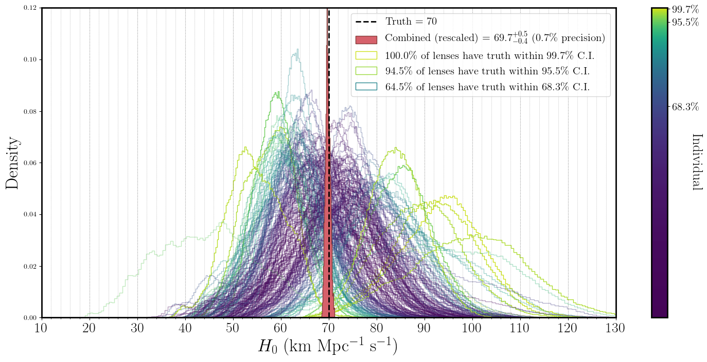

==============================================================================================================
h0rton - Deep Modeling of Strong Gravitational Time Delay Lenses for Bayesian Inference of the Hubble Constant
==============================================================================================================

.. image:: https://travis-ci.com/jiwoncpark/h0rton.svg?branch=master
    :target: https://travis-ci.org/jiwoncpark/h0rton

.. image:: https://readthedocs.org/projects/h0rton/badge/?version=latest
        :target: https://h0rton.readthedocs.io/en/latest/?badge=latest
        :alt: Documentation Status

.. image:: https://coveralls.io/repos/github/jiwoncpark/h0rton/badge.svg?branch=master
        :target: https://coveralls.io/github/jiwoncpark/h0rton?branch=master

.. image:: https://badge.fury.io/py/h0rton.svg
    :target: https://badge.fury.io/py/h0rton

.. image:: https://img.shields.io/badge/license-MIT-blue.svg?style=flat
    :target: https://github.com/jiwoncpark/h0rton/LICENSE

.. image:: https://img.shields.io/badge/astro--ph.IM-arXiv%3A2012.00042-B31B1B.svg
    :target: https://arxiv.org/abs/2012.00042

.. image:: http://img.shields.io/badge/powered%20by-AstroPy-orange.svg?style=flat
        :target: http://www.astropy.org
        :alt: Powered by Astropy Badge

This package models strong gravitational time delay lenses using Bayesian neural networks to infer the Hubble constant. It represents LSST Dark Energy Science Collaboration research in progress. Please contact Ji Won Park (@jiwoncpark) for questions on using the code.

Installation
============

0. Virtual environments are strongly recommended, to prevent dependencies with conflicting versions. Create a conda virtual environment and activate it:

::

$conda create -n h0rton python=3.6 -y
$conda activate h0rton

1. You'll need a Fortran compiler and Fortran-compiled `fastell4py`, which you can get on a debian system by running

::

$sudo apt-get install gfortran
$git clone https://github.com/sibirrer/fastell4py.git <desired location>
$cd <desired location>/fastell4py
$python setup.py install --user

2. Now do one of the following. 

**Option 2(a):** clone the repo (please do this if you'd like to contribute to the development).

::

$git clone https://github.com/jiwoncpark/h0rton.git
$cd h0rton
$pip install -e . -r requirements.txt

**Option 2(b):** pip install the release version (only recommended if you're a user).

::

$pip install h0rton

3. (Optional) To run the notebooks, add the Jupyter kernel.

::

$python -m ipykernel install --user --name h0rton --display-name "Python (h0rton)"

4. (Optional) To experiment with H0 inference using the TDLMC data, download all their data first using the provided convenience script:

::

$source h0rton/tdlmc_data/download_tdlmc_data.sh 

How to train
============

1. Generate the training and validation data, e.g.

::

$python -m baobab.generate h0rton/trainval_data/train_tdlmc_diagonal_config.py

2. Edit the configuration parameters `h0rton/example_user_config.py`. Make sure the `cfg.data` field agrees with the training data you generated.

3. Run

::

$python -m h0rton.train h0rton/example_user_config.py

You can visualize the training results by running

::

$tensorboard --logdir runs

Feedback and More
=================

Suggestions are always welcome! If you encounter issues or areas for improvement, please message @jiwoncpark or `make an issue
<https://github.com/jiwoncpark/h0rton/issues>`_.

`h0rton` was used to enter the Time Delay Lens Modeling Challenge:

* Challenge webpage: https://tdlmc.github.io/
* Experimental design paper: https://arxiv.org/abs/1801.01506

This software was developed within the LSST DESC using LSST DESC resources, and so meets the criteria given in, and is bound by, the LSST DESC Publication Policy for being a “DESC product." When referring to h0rton, please cite (Park et al 2020) and provide a link to `this repo <https://github.com/jiwoncpark/h0rton>`_. 
